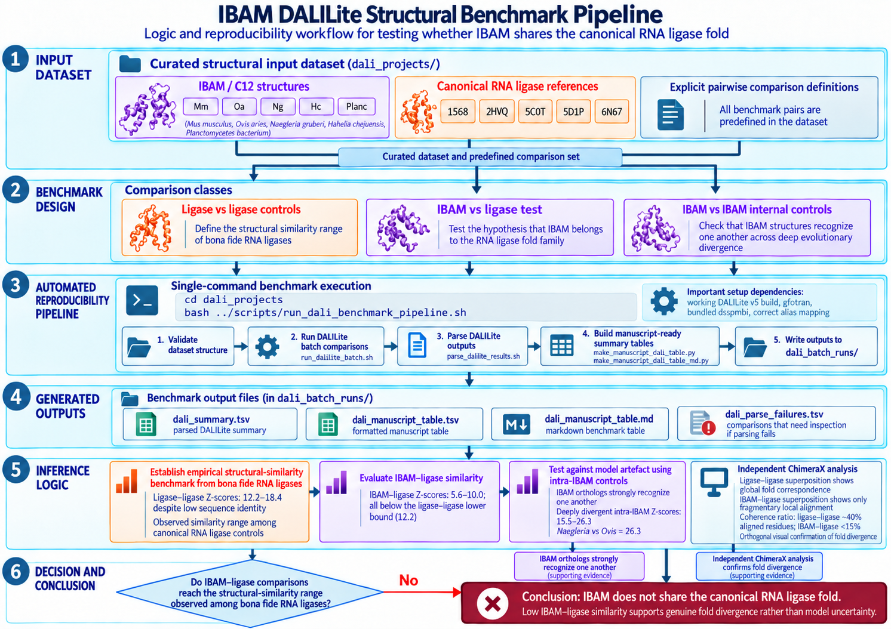

# IBAM DALILite Structural Benchmark

This repository contains the reproducibility pipeline for the structural benchmarking analyses used in the IBAM/C12orf29 study.

C12orf29 is proposed here to encode IBAM (In Between Actin and Myosin), a contractile-system protein exhibiting a deeply conserved actomyosin interaction grammar spanning approximately one billion years of evolution.

The DALILite benchmark framework tests whether IBAM conforms to canonical RNA ligase structural families, an annotation previously proposed in the literature.

The pipeline performs systematic DALILite structural comparisons between:

- canonical RNA ligases
- IBAM vs RNA ligases
- IBAM vs IBAM homologues

The goal is to rigorously test the hypothesis that C12orf29 is structurally related to RNA ligases.
The entire analysis can be reproduced with a single command.


### Benchmark workflow



The benchmark establishes the structural-similarity range observed among bona fide RNA ligases, tests IBAM against that empirical reference, and uses intra-IBAM controls together with independent ChimeraX analysis to distinguish genuine fold divergence from model uncertainty.

---


### Repository Structure
```
IBAM_DALILite_benchmark/
│
├── dali_projects/                  # Input dataset (PDB structures and comparison definitions)
│   ├── dali_1S68_vs_5COT/
│   ├── dali_1S68_vs_OaC12/
│   ├── dali_5COT_vs_2HVQ/
│   └── ... (additional comparisons)
│
├── scripts/                        # Pipeline scripts
│   ├── run_dali_benchmark_pipeline.sh
│   ├── run_dalilite_batch.sh
│   ├── parse_dalilite_results.sh
│   ├── make_manuscript_dali_table.py
│   └── make_manuscript_dali_table_md.py
│
└── README.md
```

`dali_projects/` contains the input structures only and should **not be modified**.

##### Pipeline outputs are generated automatically in:
```
dali_batch_runs/
```

---

## Species and reference-structure origins

The DALILite benchmark includes both C12/IBAM-family structures and canonical RNA ligase reference structures. The table below lists the organismal or source origin of each abbreviation used in the benchmark folder names.

| Abbreviation | Organism / source | Broad lineage | Role in benchmark |
|---|---|---|---|
| Mm | *Mus musculus* | Vertebrate / mammal | C12orf29 / IBAM-family structure; RefSeq: NP_780337.2 |
| Oa | *Ovis aries* | Vertebrate / mammal | C12orf29 / IBAM-family structure; GenBank: ADR10276 |
| Ng | *Naegleria gruberi* | Discoba / Heterolobosea | C12/IBAM-family candidate; GenBank/RefSeq: XP_002672595.1 |
| Hc | *Hahella chejuensis* NBU794 | Bacterium / Gammaproteobacteria | C12/IBAM-family candidate; RefSeq: WP_431686928.1|
| Planc | *Planctomycetes* bacterium | Bacterium / Planctomycetota MAG | C12/IBAM-family candidate; GenBank: OHB90221.1 |
| 1S68 | Tequatrovirus T4 | Bacteriophage | T4 RNA ligase 2 reference structure |
| 2HVQ | Tequatrovirus T4 | Bacteriophage | Adenylated full-length T4 RNA ligase 2 reference structure |
| 5COT | *Naegleria gruberi* | Discoba / Heterolobosea | RNA ligase reference structure |
| 5D1P | *Methanothermobacter thermautotrophicus* str. Delta H | Archaeon / Euryarchaeota | RNA ligase reference structure |
| 6N67 | *Thermochaetoides thermophila* DSM 1495 | Bacterium / Thermotogota-related lineage | RNA ligase reference structure |


The C12/IBAM-family structures are compared against RNA ligase reference structures to distinguish broad fold-level similarity from specific structural identity with canonical RNA ligases. The benchmark therefore includes both C12-vs-ligase comparisons and ligase-vs-ligase controls. 1S68 and 2HVQ are both Tequatrovirus T4 RNA ligase 2 structures, representing related reference structures from the same canonical RNA ligase family. They are retained as separate RNA ligase comparators but are not used as an internal 1S68-vs-2HVQ benchmark pair.


---

## Requirements

The pipeline requires:

```
Linux or macOS shell
DALILite v5 (built from source, including gfortran — see Installing DALILite below)
Python3
```

DALILite must be available in the system `PATH`.

Example installation location:

```
~/DaliLite/DaliLite.v5/bin/dali.pl
```

Add DALILite to the `PATH` if necessary:

```
export PATH="$HOME/DaliLite/DaliLite.v5/bin:$PATH"
```

---

## Installing DALILite

DALILite v5 is distributed as source and must be compiled locally. It requires both a C compiler and a **Fortran compiler**.

```bash
cd ~
mkdir -p DaliLite
cd DaliLite
wget http://ekhidna2.biocenter.helsinki.fi/dali/DaliLite.v5.tar.gz
tar -zxvf DaliLite.v5.tar.gz
cd DaliLite.v5/bin
make clean
make
```

`make` prints warnings that can safely be ignored. **Errors cannot be ignored** — in particular, if `gfortran` is not installed, `make` will fail partway through with `gfortran: No such file or directory` and silently skip building DALILite's core comparison binaries, while still exiting without an obvious fatal error. On Debian/Ubuntu:

```bash
sudo apt install gfortran
```

After a successful build, confirm the full binary set is present — not just the DSSP-related files:

```bash
ls ~/DaliLite/DaliLite.v5/bin/ | grep -v '\.pl$\|\.pm$\|\.o$'
```

You should see `serialcompare`, `wolf`-related helpers (via `mpicompare`), `puu`, `puutos`, `fssp`, `dsspcmbi`, and similar — not `dsspcmbi` alone. If the core binaries are missing, `make` did not complete and none of the pairwise comparisons below will run correctly.

### DSSP binary — use the bundled `dsspcmbi`, not a system DSSP install

DaliLite's importer (`import.pl`) calls a DSSP-compatible tool to compute secondary structure and solvent accessibility, configured in `bin/mpidali.pm`:

```perl
my $DSSP_EXE="$MPIDALI_BIN/dsspcmbi";
```

Leave this pointing at the **bundled `dsspcmbi`** binary built by `make` above. Do not repoint it at a system-installed `mkdssp`/DSSP 4.x package (e.g. via `apt install dssp`), even though `dsspcmbi` is an older program. Modern DSSP's output format is not fully compatible with DaliLite's downstream PUU parser and will produce **silently truncated `.dat` files** — DaliLite will report success and generate near-empty structure files with no error message, which then cause pairwise comparisons to return zero-length alignments (`Z`, `RMSD`, `lali`, `%ID` all blank in the summary table) without any indication of why.

### Validating your DALILite install

Run the built-in self-test:

```bash
cd ~/DaliLite/DaliLite.v5
./test.csh
```

**Important:** `test.csh` prints a `Result file: ...` success banner after every step *regardless of whether that step actually succeeded*. A line like:

```
* * * Result of data import: ./test/1pptA.dat * * *
cat: 1pptA.dat: No such file or directory
```

is a genuine failure, not noise — the `cat` error immediately following a "success" banner means the file was never created. Do not treat the printed banners as confirmation of success. Instead, check that the all-against-all comparison at the end of the test produces genuinely differentiated Z-scores between the structurally unrelated toy proteins (myoglobin, hemoglobin, colicin, allophycocyanin, leghemoglobin) — a matrix where every pairwise value is identical (e.g. all `0.1`) indicates the comparisons did not actually run, even if the script exits without an obvious error.

---

## Running the Benchmark

From the repository root:

```bash
cd dali_projects
bash ../scripts/run_dali_benchmark_pipeline.sh
```

The pipeline will automatically:

- validate the dataset structure
- run all DALILite pairwise structural comparisons
- parse the results
- generate manuscript-ready summary tables

Runtime on a typical workstation is approximately 1 minute.

### PDB filename convention — do not shorten filenames to fit DALILite's 4-character ID limit

DALILite itself requires structure identifiers (`--pdbid`) to be exactly 4 characters, but **the input PDB files in this repository should keep their full, original filenames** (e.g. `NgC12.pdb`, `OaC12.pdb`), not shortened versions (e.g. `Ng12.pdb`, `Oa12.pdb`).

The pipeline scripts maintain their own internal mapping from these full filenames to valid 4-character DALILite identifiers. Renaming input PDB files to manually satisfy the 4-character limit breaks this mapping and will cause the batch run to fail partway through with an error such as:

```
[DALI-BATCH ERROR] No 4-char DALILite alias defined for: Ng12
```

If you are adding a new taxon or structure to the benchmark, add its alias to the mapping used by `scripts/run_dalilite_batch.sh` — do not rename the source PDB file.

---

## Output

Each benchmark execution is written to a timestamped run directory:

```text
dali_batch_runs/YYYYMMDD_HHMMSS/
```

### Generated files

|File|Description|
|---|---|
|`dali_summary.tsv`|Parsed DALILite output|
|`dali_manuscript_table.tsv`|Formatted table used in the manuscript|
|`dali_manuscript_table.md`|Markdown version of the benchmark table|
|`dali_parse_failures.tsv`|Comparisons that produced DALILite output but could not be parsed into the summary table — check this file if any row in the summary table is unexpectedly blank|

A preview of the benchmark results is also printed to the terminal when the pipeline finishes.

---

## Reproducibility

All structural comparisons are explicitly defined in the dataset.

Running the pipeline regenerates the benchmarking table directly from the input structures without manual intervention.

This ensures that the structural benchmark reported in the study can be fully reproduced by any reviewer or reader, provided the setup notes above — particularly the `gfortran`/DSSP requirements and the PDB naming convention — are followed. These dependencies are not enforced by the pipeline scripts themselves and can fail silently if misconfigured; see **Installing DALILite** above for how to verify a working install before trusting any output.

---

## Citation

If you use this repository, please cite the associated IBAM/C12orf29 study and reference this repository directly.

Friis TE. _C12orf29 encodes IBAM (In Between Actin and Myosin), a conserved actomyosin-associated protein exhibiting deeply conserved interaction grammar across eukaryotic evolution._ Manuscript in preparation.

---

## License

MIT License

Copyright (c) Thor Friis

---


## Author

Thor Friis

[](https://orcid.org/0000-0002-4132-4912)

Independent researcher, Bodø, Norway.
PhD in Molecular Biology, Queensland University of Technology (QUT).


